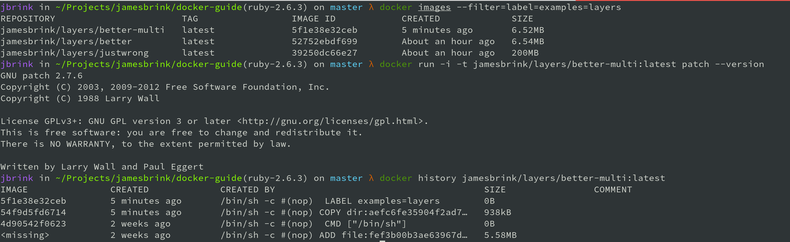
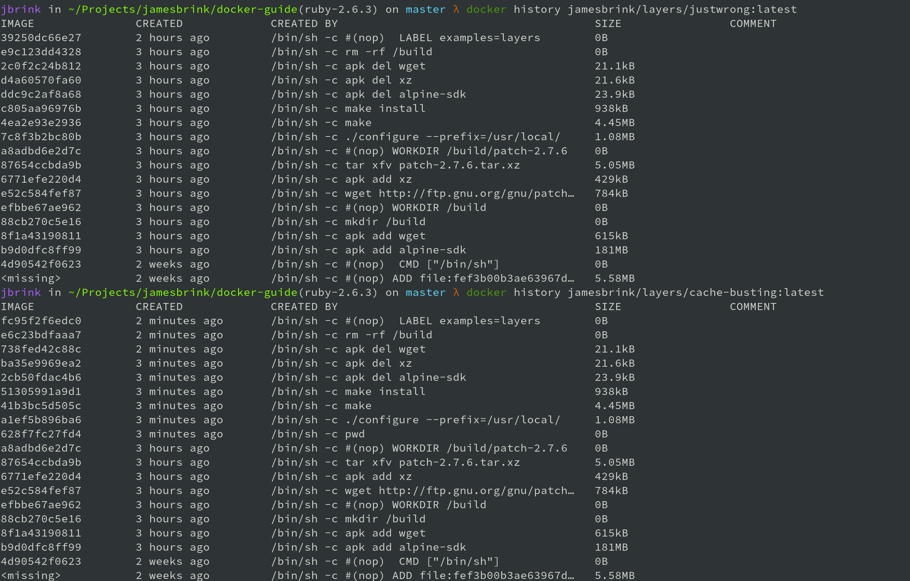

# No Bullshit guide for building Docker images

# About
This repository is going to serve as my guide to building solid docker images. It will likely be highly opinionated and possibly incorrect in places. I will try to focus only on areas that seem to have general misconceptions for novice Docker users. Pull Requests and recommendations are always welcome. 

This guide is setup to be cloned locally if you would like to run through he examples. 
To do this I recommend you have the following tools available on your machine:  

* docker
* bash
* make
* jq
  
# Table of contents
- [No Bullshit guide for building Docker images](#No-Bullshit-guide-for-building-Docker-images)
- [About](#About)
- [Table of contents](#Table-of-contents)
- [Dockerfile Unraveled](#Dockerfile-Unraveled)
  - [Shell](#Shell)
  - [Image Layers](#Image-Layers)
    - [The wrong way](#The-wrong-way)
    - [The better way](#The-better-way)
    - [Multistage Bonus Example](#Multistage-Bonus-Example)
  - [Order of instructions is important](#Order-of-instructions-is-important)
- [Base Images](#Base-Images)
  - [Always use a tagged image](#Always-use-a-tagged-image)
  - [A Caution on floating tags](#A-Caution-on-floating-tags)

# Dockerfile Unraveled

First lets touch on what a `Dockerfile` actually is and how it works. Understanding what is going on here 
will ensure you are able to build cache-efficient and slim Docker images.

## Shell
At first glance a Dockerfile looks a lot like a shell script, there is a very subtle but no accidental reason for this.
By default docker build command uses `/bin/sh` on linux hosts (see [SHELL](https://docs.docker.com/engine/reference/builder/#shell)). This means you can really use any interpreter you want to build docker images. As an example, lets assume for a moment you wanted to use Ruby to build your docker images (Can't think of a sane reason why you would). 

The following Dockerfile is valid: 
```Dockerfile
FROM ruby:2.6.3-alpine3.10
SHELL [ "/usr/local/bin/ruby", "-e" ]
RUN puts Dir.pwd
RUN foo='/foo'; \
    Dir.mkdir '/foo'; \
    Dir.chdir foo; \
    puts Dir.pwd; \
    require 'fileutils'; \
    FileUtils.touch('bar.txt')
RUN exec("apk add vim")
RUN exec("ls -lart /foo/")
```

It will create a directory with and empty file called `/foo/bar.txt` and install `vim`.  
**The point I am trying to make is that the shell script is not really a requirement of the Dockerfile and build process, it's just the default**

## Image Layers

Given the information above, knowing shell scripting is helpful, but what you really need to understand more than anything is how the Dockerfile instructions are run.

Instructions are things such as `FROM`, `RUN`, `ENV`, `EXPOSE`, etc. They are always in caps and they have a 1-1 relationship with **Docker layers**. Nearly every instruction is a layer. Generally speaking less is better. This is why you will often see `RUN` commands that are in a multi-line format and strung together in a way they makes you want to throw up from looking at it. 

### The wrong way

It's important to understand that these layers are immutable in a similar way to a git commits. Take the following extreme example of how not to build Docker images. For this example we will download and build **GNU patch**

```Dockerfile
FROM alpine:3.10
RUN apk add alpine-sdk
RUN apk add wget
RUN mkdir /build
WORKDIR /build
RUN wget http://ftp.gnu.org/gnu/patch/patch-2.7.6.tar.xz
RUN apk add xz
RUN tar xfv patch-2.7.6.tar.xz
WORKDIR /build/patch-2.7.6
RUN ./configure --prefix=/usr/local/
RUN make
RUN make install
RUN apk del alpine-sdk
RUN apk del xz
RUN apk del wget
RUN rm -rf /build
LABEL examples=layers
```

If you are doing this in your docker images, **You are doing it WRONG**.  
Lets build and inspect this image.

```shell
docker build --file=examples/layers/Dockerfile.justwrong -t jamesbrink/layers/justwrong .
```

You can verify the image works and containers our downloaded version of patch:
```shell
docker run -i -t jamesbrink/layers/justwrong patch --version
```

Once build completes you should see the new docker image, since we added a label we can list it like so:
```shell
docker images --filter=label=examples=layers
```

You will see the image is ~200MB uncompressed. Now lets inspect the image a bit more with the `history` command.  

Running the history command will show you each layer with its size.
```shell
docker history jamesbrink/layers/justwrong:latest
```


You can basically sum the sizes in the the `size` column and calculate the final image size just the same. **The take away here is that removing files, packages etc in later steps does not remove them from the final image's size**

### The better way

Now that we have built a bloated ass version Docker image containing patch, lets build it again but more efficiently.

```Dockerfile
FROM alpine:3.10
RUN set -xe; \
    apk add --no-cache --virtual .build-deps \
        alpine-sdk \
        wget \
        xz; \
    mkdir -p /build; \
    cd /build; \
    wget http://ftp.gnu.org/gnu/patch/patch-2.7.6.tar.xz; \
    tar xfv patch-2.7.6.tar.xz; \
    cd /build/patch-2.7.6; \
    ./configure --prefix=/usr/local/; \
    make; \
    make install; \
    cd /; \
    rm -rf /build; \
    apk del .build-deps;

LABEL examples=layers
```

Given the above Dockerfile lets build it again like so:
```shell
docker build --file=examples/layers/Dockerfile.better -t jamesbrink/layers/better .
```

And again let's verify GNU patch is working:
```shell
docker run -i -t jamesbrink/layers/better patch --version
```

Lets look at the history for this new image.
```shell
docker history jamesbrink/layers/better:latest
```


Now lets compare the sizes between each of these images:
```shell
docker images --filter=label=examples=layers
```

You will see the new image is only ~ 6.54MB, this is a drastic difference from the original 200MB image. Feel free to inspect the history which is now down from 19 layers to 5.


### Multistage Bonus Example

It's worth noting briefly that in cases like this you can still use the original bad example and produce a clean image 
using multi-stage builds. Notice i removed the cleanup commands from this image to show how they are not required.

```Dockerfile
FROM alpine:3.10 as builder
RUN apk add alpine-sdk
RUN apk add wget
RUN mkdir /build
WORKDIR /build
RUN wget http://ftp.gnu.org/gnu/patch/patch-2.7.6.tar.xz
RUN apk add xz
RUN tar xfv patch-2.7.6.tar.xz
WORKDIR /build/patch-2.7.6
RUN ./configure --prefix=/usr/local/
RUN make
RUN make install

FROM alpine:3.10

COPY --from=builder /usr/local /usr/local

LABEL examples=layers
```

**Notice when building this, it will re-use cache from original build** we will touch on this later, but this is one caveat where having multiple layers like the original bad example could be advantageous. 
```shell
docker build --file=examples/layers/Dockerfile.better.multi-stage -t jamesbrink/layers/better-multi .
```



## Order of instructions is important

It's important to understand how the order of the instructions impact the re-use of cache. This is a very simple concept, but one that I see overlooked by people who are new to building Docker images.  

Let's rebuild the Dockerfile.justwrong mentioned in the previous section. We will use this one just to demonstrate caching. If you have not built it yet run the following:  
```shell
docker build --file=examples/layers/Dockerfile.justwrong -t jamesbrink/layers/justwrong .
```

The first build will take a few minutes, but if you re-run the same build command you will see it completes instantly. This is due to Docker's default use of cache. 

Layers/Instructions are cached from top to bottom, its this simple. Let's build a nearly identical Docker image.

```Dockerfile
FROM alpine:3.10
RUN apk add alpine-sdk
RUN apk add wget
RUN mkdir /build
WORKDIR /build
RUN wget http://ftp.gnu.org/gnu/patch/patch-2.7.6.tar.xz
RUN apk add xz
RUN tar xfv patch-2.7.6.tar.xz
WORKDIR /build/patch-2.7.6
RUN pwd
RUN ./configure --prefix=/usr/local/
RUN make
RUN make install
RUN apk del alpine-sdk
RUN apk del xz
RUN apk del wget
RUN rm -rf /build
LABEL examples=layers
```

The only change here is the addition of line #10 `RUN pwd`, a useless instruction to print our working directory. Lets
run the build:
```shell
docker build --file=examples/layers/Dockerfile.cache.busting -t jamesbrink/layers/cache-busting .
```

What you will notice is that it will re-use cache for all steps leading up the new `RUN pwd` instruction. From this line on it will create new image layers for all instructions until it completes the build. The end result is essentially the same, just with different image layers after this `RUN pwd` instruction. In the following output you will notice the image IDs are identical up until this new instruction (read history from bottom to top). 



This basic knowledge will be vital when you start working on larger more complex Docker builds. It's also worth noting that docker images built on different hosts will contains different sha256 sums. This is to protect against nasty things like cache poising.  

If you would like to use cache from a build created on another host you could use `--cache-from=` command line option.

```shell
docker build my image . --cache-from=some-other-image
```

Here is an example of this from one of my other projects [docker-darling cached build](https://github.com/utensils/docker-darling/blob/master/Makefile#L40). This particular image takes 3 hours to build so it's a life saver on circle-ci.

**If you're familiar with git, you could almost look at this like a branch or fork.**


# Base Images

The first thing to consider when building a docker image is which base image to start with. 
Nine times out of ten I would say use Alpine. I say this because its very small and generally more secure. 
I have found the Alpine images tend to be patched for CVEs quicker than most other base images. 

## Always use a tagged image

It is highly recommended to always use a tagged image, in this case we will use `alpine:3.10`. This keeps builds
consistent, you should not have any surprises when you try to re-build the image 6 months from now as you might if you used `latest` (which is the default when tag name is omitted)

```Dockerfile
FROM alpine:3.10
```

## A Caution on floating tags

It's important to note the difference between some common image tags such as **latest** and **stable**. These are floating tags meaning the underlying image will change over time. This one can bite you hard if you are unaware. Some images such as [Debian](https://hub.docker.com/_/debian/?tab=tags) use a stable tag, and whenever there is a new stable release of Debian this tag will be updated and could potentially break your Docker builds. An example of this is Debian 9 being released making the stable tag move from debian:8 to debian:9. It's not the end of the world, but just be aware of this, and how it could effect your builds.  

Additional some people like to update versioned tags the same way, nothing you can do about that.


